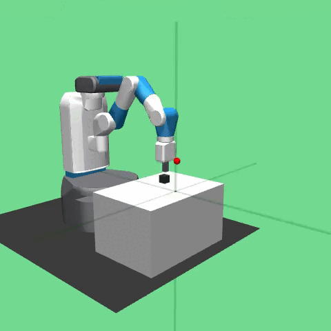
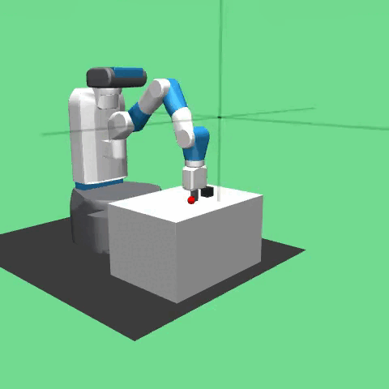
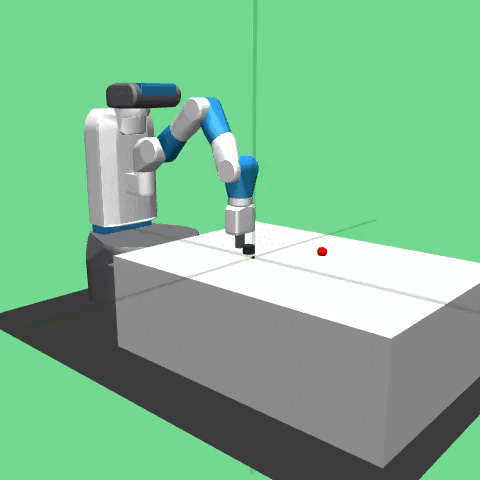
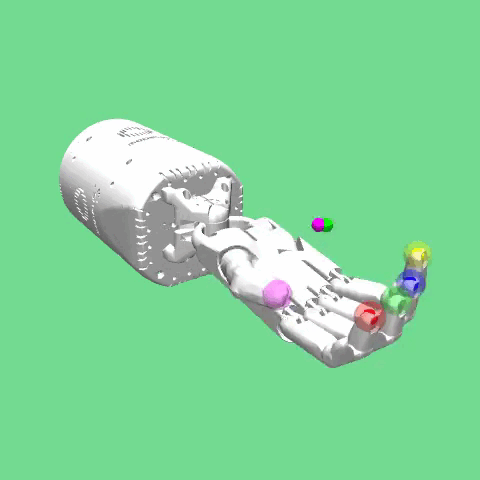
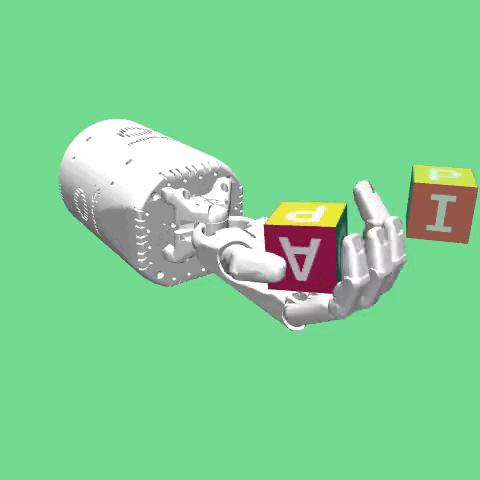
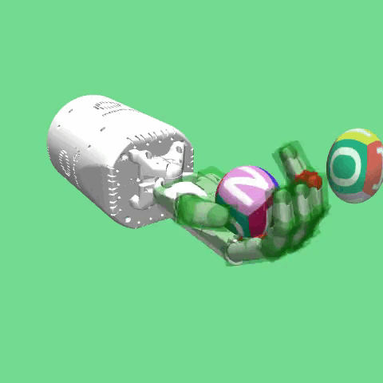

# Farama Robotics Reinforcement Learning 

# Environments

## Fetch 
|   | [Pick and Place](https://robotics.farama.org/envs/fetch/pick_and_place/) | [Push](https://robotics.farama.org/envs/fetch/push/) | [Reach](https://robotics.farama.org/envs/fetch/reach/) | [Slide](https://robotics.farama.org/envs/fetch/slide/) |
|---|--------------------------------------------------------------------------|------------------------------------------------------|--------------------------------------------------------|--------------------------------------------------------|
|Visualization|  |  |  |  | 
|Action Space | (4,) | (4,) | (4,) | (4,) | 
|Observation Space| (25,) | (25,) | (10,) | (25, ) |

## Shadow Dexterous Hand
|   | [Reach](https://robotics.farama.org/envs/shadow_dexterous_hand/reach/) | [Manipulate Block](https://robotics.farama.org/envs/shadow_dexterous_hand/manipulate_block/) | [Manipulate Block Touch Sensors](https://robotics.farama.org/envs/shadow_dexterous_hand/manipulate_block_touch_sensors/) | [Manipulate Egg](https://robotics.farama.org/envs/shadow_dexterous_hand/manipulate_egg/) |
|---|--------------------------------------------------------------------------|------------------------------------------------------|--------------------------------------------------------|--------------------------------------------------------|
|Visualization|  |  |  |  | 
|Action Space | (20,) | (20,) | (,) | (20,) | 
|Observation Space| (63,) | (61,) | (,) | (61, ) |

|   | [Manipulate Egg Touch Sensors](https://robotics.farama.org/envs/shadow_dexterous_hand/manipulate_egg_touch_sensors/) | [Manipulate Pen](https://robotics.farama.org/envs/shadow_dexterous_hand/manipulate_pen/) | [Manipulate Pen Touch Sensors](https://robotics.farama.org/envs/shadow_dexterous_hand/manipulate_pen_touch_sensors/) |
|---|--------------------------------------------------------------------------|------------------------------------------------------|--------------------------------------------------------|
|Visualization|  |  |  |
|Action Space | (,) | (20,) | (,) |
|Observation Space| (,) | (61,) | (,) |


## Adroit Hand
|   | [Adroit Door](https://robotics.farama.org/envs/adroit_hand/adroit_door) | [Adroit Hammer](https://robotics.farama.org/envs/adroit_hand/adroit_hammer) | [Adroit Pen](https://robotics.farama.org/envs/adroit_hand/adroit_pen) | [Adroit Relocate](https://robotics.farama.org/envs/adroit_hand/adroit_relocate) |
|---|--------------------------------------------------------------------------|------------------------------------------------------|--------------------------------------------------------|--------------------------------------------------------|
|Visualization|  |  |  |  | 
|Action Space | (28,) | (26,) | (24,) | (30,) | 
|Observation Space| (39,) | (46,) | (45,) | (39, ) |

## Franka Kitchen
|   | [Franka Kitchen](https://robotics.farama.org/envs/franka_kitchen/franka_kitchen) |
|---|--------------------------------------------------------------------------|
|Visualization|  |
|Action Space | (9,) |
|Observation Space| (59,) |

# Dependencies 
- Python version : 3.10.20 
- Libraries : 
    - numpy==2.2.6 
    - gymnasium==1.3.0 
    - gymnasium_robotics==1.4.2 
    - omegaconf==2.3.0 
    - torch==2.12.0 
    - tensorboard==2.20.0 
    - PyYAML==6.0.3 
- Installation: 
```bash 
pip install -r requirements.txt
```
- If you use [conda](https://docs.conda.io/projects/conda/en/latest/user-guide/install/index.html) virtual environment
```bash
conda create -n robotic_rl python=3.10.20
conda activate robotic_rl 
pip install -r requirements.txt 
``` 
- If you use [venv](https://docs.python.org/3/library/venv.html)  virtual environment
    - **Windows** : 
    ```bash 
    py -3.10 -m venv .venv
    .venv\Scripts\activate
    pip install -r requirements.txt
    ```
    - **Linux/MacOS**: 
    ```bash 
    python3.10 -m venv .venv
    source .venv/bin/activate
    pip install -r requirements.txt
    ```
- **Verify Setup** (Optional) : After installing the dependencies, run the following command to verify that the environment is configured correctly:

# Usage
## Train 
```bash 
# Example usage 
python main.py --agent SAC --config configs/SAC.yaml
```
| Flag      | Description           | Available value | Default value | 
| --------- | ----------------------| --------------- | ------------- | 
| `--agent` | Select Agent          | [`SAC`, `SACHER`, `PPO`] | `SAC`         |
| `--config`| Config file path      |                 | `configs/SAC.yaml`/`configs/SACHER.yaml`/`configs/PPO.yaml` based on `--agent` |

## TensorBoard 
- Training results can be visualized using [TensorBoard](https://docs.pytorch.org/docs/main/tensorboard.html)
```bash 
# Example Usage
tensorboard --logdir logs/tensorboard_logs/Hopper-v5/SAC_Hopper_20260408_163845/
```

# Results 

- The configurations used to train these agents are presented in [docs](docs/hyperparams.md)

# Demonstration


